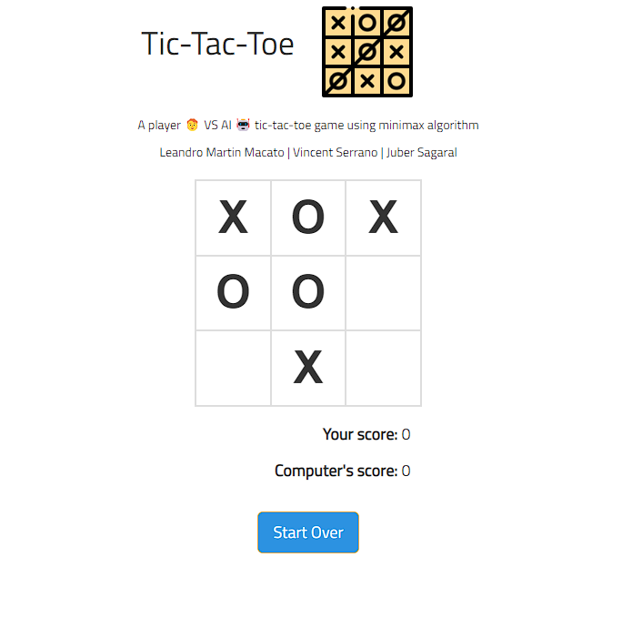

# Tic-tac-toe Player VS AI minimax algorithm



- [Tic-tac-toe Player VS AI minimax algorithm](#tic-tac-toe-player-vs-ai-minimax-algorithm)
  - [About](#about)
  - [Installation](#installation)
    - [1. Clone Repository](#1-clone-repository)
    - [2. pip install requirements](#2-pip-install-requirements)
    - [3. Run Flask Server](#3-run-flask-server)
## About

A Player Vs AI Tic-Tac-Toe game using minimax algorithm for

## Installation

### 1. Clone Repository

```cmd
git clone https://github.com/LeandroMartinMacato/minimax-tictactoe-flask
```

### 2. pip install requirements

```cmd
pip install -r requirements.txt
```

### 3. Run Flask Server

```
./app python app.py
```
